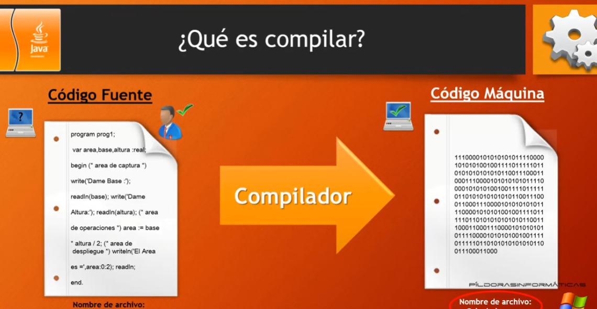

# 1. Presentacion

**Temario Parte 1**
- Descarga e instalacion de Eclipse
- Introduccion a Java
- Estructuras principales del lenguaje
- Objetos y clases
- Herencia
- Clases internas e interfaces
- Programacion de graficos
- Eventos
- Componentes Swing
- Aplicaciones y Applets
- Tratamientos de errores (excepciones) y depuracion
- Programacion generica
- Colecciones
- Programacion multihilo (multithreading)

**Temario parte 2**
- Programacion con archivos
- XML
- Programacion para redes
- Programacion para BBDD
- Programacion cliente - servidor (objetos distribuidos)
- Swing Avanzado
- AWT Avanzado
- JavaBeans
- Seguridad
- Programacion internacional
- Metodos nativos
- Anotaciones

# 2. Instalacion JRE y Eclipse





```java
public class PrimeraClase {
	public static void main(String[] args) {
		System.out.println("Hola mundo");
	}
}
```

# 3. Introduccion 


# 4. Estructuras principales I

**Tipos de programas**
- Aplicaciones de consola
- Aplicaciones de proposito general
- Applets


Es case sensitive(sensible a mayusculas y minusculas)

# 5. Estructuras principales del lenguaje II


# 6. Estructuras principales del lenguaje III

```java
public class Variables {
	public static void main(String[] args) {
		/*byte edad;
		edad=35;*/
		
		byte edad = 35; //Declaracion e iniciacion de una variable
		edad = 75;
		System.out.print("Mi edad es: " + edad);
	}
}
```

# 7. Estructuras principales del lenguaje IV - Constantes y Operadores I


```java
public class Declaraciones_Operadores {
	public static void main(String[] args) {
		int a = 5;
		int b;
		b = 7;
		int c = b + a;
		//c++;
		//c += 6;
		//c -= 6;
		
		/*Si quisieramos hacer una division, es necesario que todas
		 * las variables sean flotantes o double, y no solo la variable de resultado
		 * double a = 5;
		 * double b;
		 * b = 7;
		 * double c = b / a;
		 * */
		System.out.println(c);
	}
}
```

# 8. Estructuras principales del lenguaje V - Constantes y Operadores II

```java
public class Declaraciones_Operadores {
	public static void main(String[] args) {
		//final int c = 5; Declaracion y asignacion de una constante
		
		final double apulgadas = 2.54;
		double cm = 6;
		double resultado = cm / apulgadas;
		
		System.out.println("En " + cm + " cm hay " + resultado + " pulgadas");
		
		/*Otra forma de declarar las variables
		 * int operador1, operador2, resultado;
		 * operador1 = 8;
		 * operador2 = 7;
		 * resultado = operador1 + operador2;
		 * System.out.println(resultado);*/
	}
}
```

# 9. Estructuras principales del lenguaje VI - Clase Math

Biblioteca de clases (API):

 https://docs.oracle.com/javase/7/docs/api/


https://docs.oracle.com/en/java/javase/20/docs/api/index.html


```java
public class Calculos_conMath {
	public static void main(String[] args) {		
		double raiz = Math.sqrt(9);
		System.out.println(raiz);
	}
}
```

# 10. Estructuras principales del lenguaje VII - Clase Math II


```java
public class Calculos_conMath {
	public static void main(String[] args) {		
		/*double raiz = Math.sqrt(9);
		  double num1 = 5.85;
		  int resultado = Math.round(num1);
		
		  Refundicion: Si queremos forzar a que la variable resultado almacene un entero(ya que el metodo round
		  devuelve un double, solo tenemos que agregarle un parentesis indicandole
		  a que tipo de dato se convertira)
		  double num1 = 5.85;
		  int resultado = (int)Math.round(num1);
		  
		
		  double num1 = 5.85;
		  int resultado = (int)Math.round(num1);
		  System.out.println(resultado);*/
		
		double base = 5;
		double exponente = 3;
		int resultado = (int)Math.pow(base, exponente);
		System.out.println("El resultado de " + base + " elevado a " + exponente + " es " + resultado);
	}
}
```