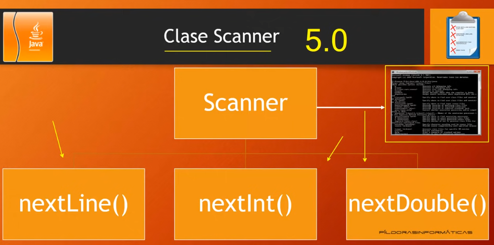
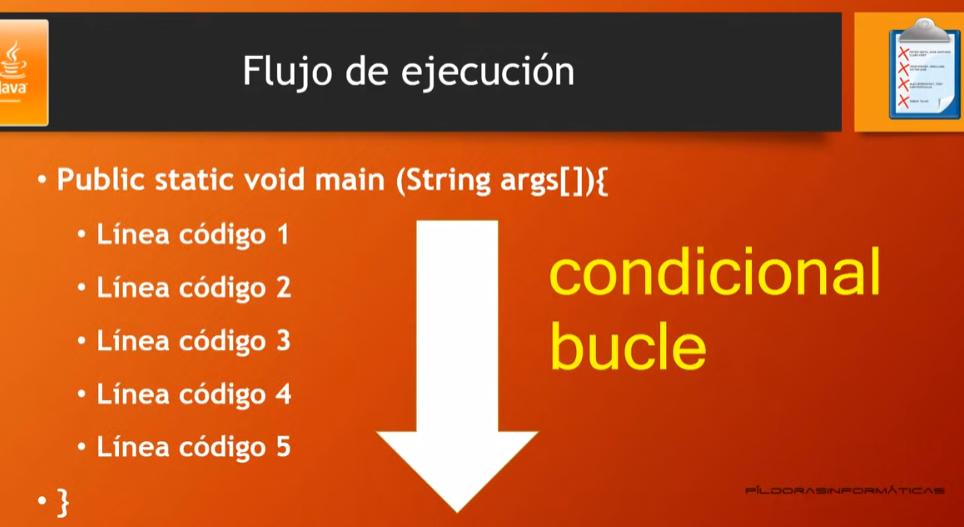
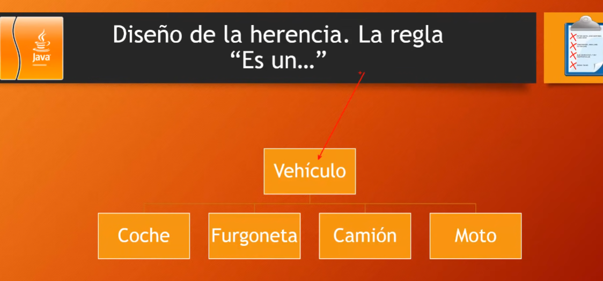
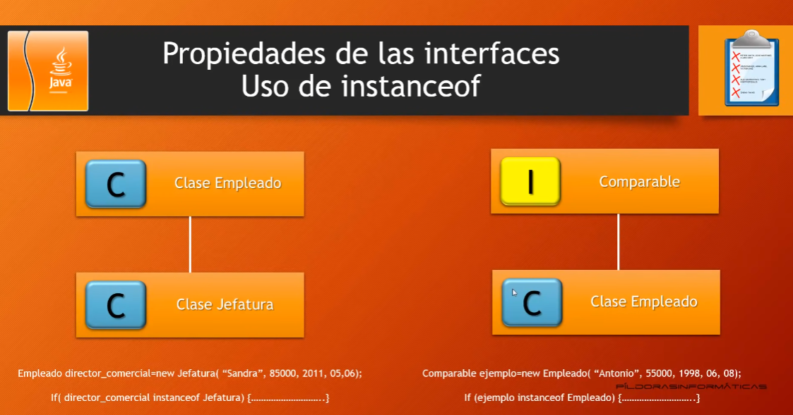
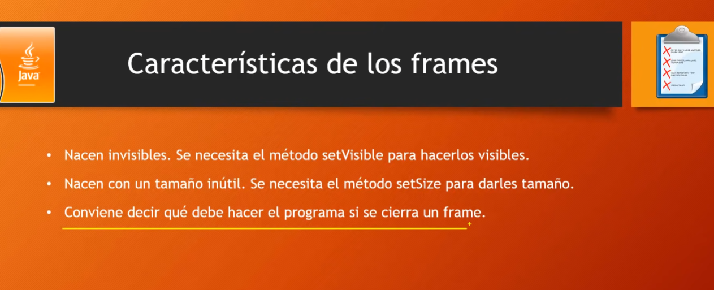
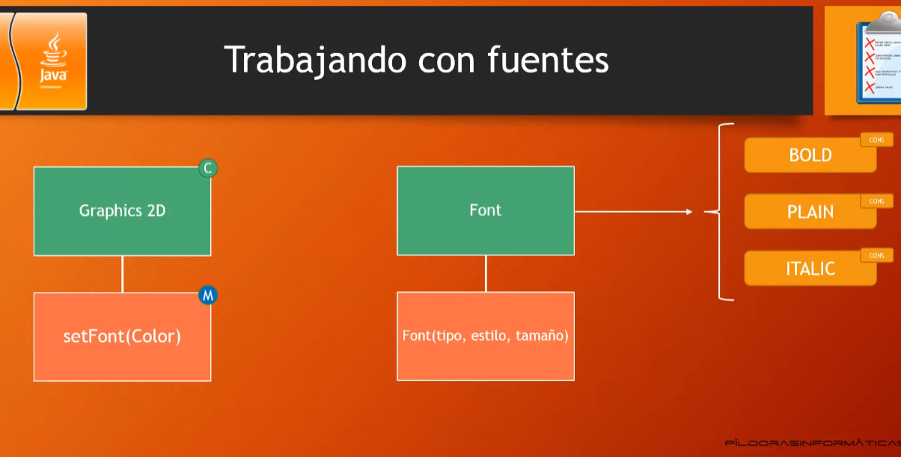

# 1. Presentacion

**Temario Parte 1**
- Descarga e instalacion de Eclipse
- Introduccion a Java
- Estructuras principales del lenguaje
- Objetos y clases
- Herencia
- Clases internas e interfaces
- Programacion de graficos
- Eventos
- Componentes Swing
- Aplicaciones y Applets
- Tratamientos de errores (excepciones) y depuracion
- Programacion generica
- Colecciones
- Programacion multihilo (multithreading)

**Temario parte 2**
- Programacion con archivos
- XML
- Programacion para redes
- Programacion para BBDD
- Programacion cliente - servidor (objetos distribuidos)
- Swing Avanzado
- AWT Avanzado
- JavaBeans
- Seguridad
- Programacion internacional
- Metodos nativos
- Anotaciones

# 2. Instalacion JRE y Eclipse


```java
public class PrimeraClase {
	public static void main(String[] args) {
		System.out.println("Hola mundo");
	}
}
```

# 3. Introduccion 


# 4. Estructuras principales I

**Tipos de programas**
- Aplicaciones de consola
- Aplicaciones de proposito general
- Applets


Es case sensitive(sensible a mayusculas y minusculas)

# 5. Estructuras principales del lenguaje II


# 6. Estructuras principales del lenguaje III

```java
public class Variables {
	public static void main(String[] args) {
		/*byte edad;
		edad=35;*/
		
		byte edad = 35; //Declaracion e iniciacion de una variable
		edad = 75;
		System.out.print("Mi edad es: " + edad);
	}
}
```

# 7. Estructuras principales del lenguaje IV - Constantes y Operadores I


```java
public class Declaraciones_Operadores {
	public static void main(String[] args) {
		int a = 5;
		int b;
		b = 7;
		int c = b + a;
		//c++;
		//c += 6;
		//c -= 6;
		
		/*Si quisieramos hacer una division, es necesario que todas
		 * las variables sean flotantes o double, y no solo la variable de resultado
		 * double a = 5;
		 * double b;
		 * b = 7;
		 * double c = b / a;
		 * */
		System.out.println(c);
	}
}
```

# 8. Estructuras principales del lenguaje V - Constantes y Operadores II

```java
public class Declaraciones_Operadores {
	public static void main(String[] args) {
		//final int c = 5; Declaracion y asignacion de una constante
		
		final double apulgadas = 2.54;
		double cm = 6;
		double resultado = cm / apulgadas;
		
		System.out.println("En " + cm + " cm hay " + resultado + " pulgadas");
		
		/*Otra forma de declarar las variables
		 * int operador1, operador2, resultado;
		 * operador1 = 8;
		 * operador2 = 7;
		 * resultado = operador1 + operador2;
		 * System.out.println(resultado);*/
	}
}
```

# 9. Estructuras principales del lenguaje VI - Clase Math

Biblioteca de clases (API):

 https://docs.oracle.com/javase/7/docs/api/


https://docs.oracle.com/en/java/javase/20/docs/api/index.html


```java
public class Calculos_conMath {
	public static void main(String[] args) {		
		double raiz = Math.sqrt(9);
		System.out.println(raiz);
	}
}
```

# 10. Estructuras principales del lenguaje VII - Clase Math II


```java
public class Calculos_conMath {
	public static void main(String[] args) {		
		/*double raiz = Math.sqrt(9);
		  double num1 = 5.85;
		  int resultado = Math.round(num1);
		
		  Refundicion: Si queremos forzar a que la variable resultado almacene un entero(ya que el metodo round
		  devuelve un double, solo tenemos que agregarle un parentesis indicandole
		  a que tipo de dato se convertira)
		  double num1 = 5.85;
		  int resultado = (int)Math.round(num1);
		  
		
		  double num1 = 5.85;
		  int resultado = (int)Math.round(num1);
		  System.out.println(resultado);*/
		
		double base = 5;
		double exponente = 3;
		int resultado = (int)Math.pow(base, exponente);
		System.out.println("El resultado de " + base + " elevado a " + exponente + " es " + resultado);
	}
}
```

# 11. Manipulacion de cadenas - Clase String I


```java
public class Manipula_Cadenas {
	public static void main(String[] args) {
		String nombre = "Juan";
		System.out.println("Mi nombre es: " + nombre);
		System.out.println("Mi nombre tiene: " + nombre.length() + " letras");
		System.out.println("La primera letra de mi nombre es: " + nombre.charAt(0));
		
		int ultima_letra;
		ultima_letra = nombre.length();
		System.out.println("La ultima letra de mi nombre es: " + nombre.charAt(ultima_letra - 1));
	}
}
```

# 12. Manipulacion de cadenas - Clase String II

```java
public class Manipula_Cadenas_II {
	public static void main(String[] args) {
		String frase = "Hoy es un estupendo dia para aprender a programar en java";
		//String frase_resumen = frase.substring(29, 57);
		String frase_resumen = frase.substring(0, 28) + " irnos a la playa y olvidarnos de todo..." + " y " + frase.substring(29,57);
		System.out.println(frase_resumen);
	}
}
```

```java
public class Manipula_Cadenas_III {
	public static void main(String[] args) {
		String alumno1, alumno2;
		alumno1 = "David";
		alumno2 = "david";
		System.out.println(alumno1.equals(alumno2));  //false
		System.out.println(alumno1.equalsIgnoreCase(alumno2));	//true
	}
}
```

# 13. Acercamiento a la API Paquetes


```java
//import java.util.*;
import java.util.Scanner;
//import java.util.Locale;
public class prueba {
	public static void main(String[] args) {
		String nombre;
		Scanner miObjeto;
		//Locale miobjeto2;
	}
}
```

# 14. Entrada Salida datos I




```java
import java.util.*;
public class Entrada_ejemplo1 {
	public static void main(String[] args) {
		Scanner entrada = new Scanner(System.in);
		System.out.print("Introduce tu nombre: ");
		String nombre = entrada.nextLine(); 		
		System.out.print("Introduce tu edad: ");
		int edad = entrada.nextInt(); 	
		System.out.println("El nombre es: " + nombre);
		System.out.println("La edad es: " + edad);
	}
}
```

# 15. Entrada Salida datos II

```java
import javax.swing.*;
public class Entrada_ejemplo2 {
	public static void main(String[] args) {
		String nombre = JOptionPane.showInputDialog("Introduce tu nombre: ");
		//String edad = ;
		
		//Convirtiendo a int un string
		int edad = Integer.parseInt(JOptionPane.showInputDialog("Introduce tu edad: "));
		System.out.println("Hola " + nombre + ", tu edad en un año es " + (edad + 1));
	}
}
```

```java
import javax.swing.*;
public class Entrada_Numeros {
	public static void main(String[] arg) {
		//double x = 1000.0;
		//Dando formato, dandole dos decimales al resultado
		//System.out.printf("%1.2f",x/3);
		
		String num1 = JOptionPane.showInputDialog("Introduce un numero");
		double num2 = Double.parseDouble(num1);
		System.out.print("La raiz de " + num2 + " es ");
		System.out.printf("%1.2f",Math.sqrt(num2));
	}
}
```

# 16. Condicionales I




```java
import java.util.*;
public class Evalua_Edad {
	public static void main(String[] args) {
		Scanner entrada = new Scanner(System.in);
		System.out.print("Introduce tu edad: ");
		int edad = entrada.nextInt();
		
		/*if (edad >= 18) {
			System.out.println("Eres mayor de edad");
		} else {
			System.out.println("Eres menor de edad");
		}*/
		
		if (edad < 18) {
			System.out.println("Eres un adolescente");
		} else if (edad < 40){
			System.out.println("Eres un joven");
		}else if (edad < 65) {
			System.out.println("Eres maduro");
		}else {
			System.out.println("Cuidate");
		}
	}
}
```

# 17. Condicionales II

```java
import java.util.*;
import javax.swing.*;
public class Areas {
	public static void main(String[] args) {
		Scanner entrada = new Scanner(System.in);
		System.out.println("Elige una opcion: \n1: Cuadrado \n2. Rectangulo \n3. Triangulo \n4. Circulo");
		int figura = entrada.nextInt();
		switch (figura) {
		case 1: {			
			int lado = Integer.parseInt(JOptionPane.showInputDialog("Introduce el lado: ")) ;
			System.out.println("El area del cuadrado es: " + Math.pow(lado, 2));
			break;
		}
		case 2: {
			int base = Integer.parseInt(JOptionPane.showInputDialog("Introduce la base: ")) ;
			int altura = Integer.parseInt(JOptionPane.showInputDialog("Introduce la altura: ")) ;
			System.out.println("El area del rectangulo es: " + base*altura);
			break;
		}case 3: {
			int base = Integer.parseInt(JOptionPane.showInputDialog("Introduce la base: ")) ;
			int altura = Integer.parseInt(JOptionPane.showInputDialog("Introduce la altura: ")) ;
			System.out.println("El area del triangulo es: " + (base*altura)/2);
			break;
		}case 4: {
			int radio = Integer.parseInt(JOptionPane.showInputDialog("Introduce el radio: ")) ;
			System.out.print("El area del circulo es: ");
			System.out.printf("%1.2f", + Math.PI*Math.pow(radio, 2));
			break;
		}
		default:
			System.out.println("Elija una opcion correcta");
		}
	}
}
```

# 18. Java Bucles I


```java
import javax.swing.*;
public class Acceso_aplicacion {
	public static void main(String[] args) {
		String clave = "Juan";
		String pass="";		
		while(clave.equals(pass)==false) {
			pass = JOptionPane.showInputDialog("Digite la contraseña: ");
			if (clave.equals(pass) == false) {
				System.out.println("Contraseña incorrecta");	
			}
		}
		System.out.println("Contraseña correcta. Bienvenido");
	}
}
```

# 19. Java Bucles II

```java
import java.util.*;
public class Adivina_Numero {
	public static void main(String[] args) {
		int aleatorio = (int)(Math.random()*100);
		Scanner entradaScanner = new Scanner(System.in);
		int numero = 0;
		int intentos = 0;
		while (numero != aleatorio) {
			intentos++;
			System.out.print("Digite un numero: ");
			numero = entradaScanner.nextInt();
			if (numero > aleatorio) {
				System.out.println("El numero a adivinar es menor");
			}else if(numero < aleatorio){
				System.out.println("El numero a adivinar es mayor");
			}
		}
		System.out.println("Acertaste, el numero a adivinar es: " + aleatorio + " . Lo lograste en el intento N°" + intentos);
	}
}
```

# 20. Java Bucles III


```java
import java.util.*;
public class Adivina_Numero {
	public static void main(String[] args) {
		int aleatorio = (int)(Math.random()*100);
		Scanner entrada = new Scanner(System.in);
		int numero = 0;
		int intentos = 0;
		do{
			intentos++;
			System.out.print("Digite un numero: ");
			numero = entrada.nextInt();
			if (numero > aleatorio) {
				System.out.println("El numero a adivinar es menor");
			}else if(numero < aleatorio){
				System.out.println("El numero a adivinar es mayor");
			}
		}while (numero != aleatorio); 
		System.out.println("Acertaste, el numero a adivinar es: " + aleatorio + " . Lo lograste en el intento N°" + intentos);
	}
}
```

```java
import javax.swing.*;
public class Peso_ideal {
	public static void main(String[] args) {
		String genero = "";
		do {
			genero = JOptionPane.showInputDialog("Introduce tu genero (H/M)");
		} while (genero.equalsIgnoreCase("H") == false && genero.equalsIgnoreCase("M") == false);
		int altura = Integer.parseInt(JOptionPane.showInputDialog("Introduce altura en cm"));
		int pesoideal = 0;
		if (genero.equalsIgnoreCase("H")) {
			pesoideal = altura - 110;
		}else if(genero.equalsIgnoreCase("M")) {
			pesoideal = altura - 120;
		}
		System.out.println("Tu peso ideal es: " + pesoideal + " kg");
	}
}
```

# 21. Java Bucles IV


```java
public class Uso_Bucle_For {
	public static void main(String[] args) {
		for (int i = 0; i < 10; i++) {
			System.out.println("Nick");
		}
	}
}
```

```java
import javax.swing.JOptionPane;
public class Comprueba_mail {
	public static void main(String[] args) {
		boolean arroba = false;
		String mail = JOptionPane.showInputDialog("Introduce email");
		for (int i = 0; i < mail.length(); i++) {
			if (mail.charAt(i) == '@') {
				arroba = true;
			}
		}
		if (arroba == true) {
			System.out.println("Email correcto");
		} else {
			System.out.println("No es correcto");
		}
	}
}
```

# 22. Java Bucles V

```java
import javax.swing.JOptionPane;
public class Comprueba_mail {
	public static void main(String[] args) {
		int arroba = 0;
		boolean punto = false;
		String mail = JOptionPane.showInputDialog("Introduce email");
		for (int i = 0; i < mail.length(); i++) {
			if (mail.charAt(i) == '@') {
				arroba++;
			}
			if(mail.charAt(i) == '.') {
				punto = true;
			}
		}
		if (arroba == 1 && punto == true) {
			System.out.println("Email correcto");
		} else {
			System.out.println("No es correcto");
		}
	}
}
```

```java
import javax.swing.*;
public class Factorial {
	public static void main(String[] args) {
		int resultado = 1;
		int numero = Integer.parseInt(JOptionPane.showInputDialog("Introduce un numero"));
		for (int i = numero; i > 0; i--) {
			resultado = resultado * i; 
		}
		System.out.println("El factorial de " + numero + " es " + resultado);
	}
}
```

# 23. Arrays I


```java
public class Uso_Arrays {
	public static void main(String[] args) {
		int [] mi_matriz = new int[5];
		//int mi_matriz[] = new int[5]
		
		mi_matriz[0] = 5;
		mi_matriz[1] = 38;
		mi_matriz[2] = -15;
		mi_matriz[3] = 92;
		mi_matriz[4] = 71;
		
		// int [] mi_matriz = {5, 38, -15, 92, 71}
		//System.out.println(mi_matriz[3]);
		
		for (int i = 0; i < mi_matriz.length; i++) {
			System.out.println("Valor del indice " + i + "=" + mi_matriz[i]);
		}
	}
}
```

# 24. Arrays II

```java
public class Uso_Arrays_II {
	public static void main(String[] args) {
		/*String [] paises = new String[8];
		paises[0] = "España";
		paises[1] = "México";
		paises[2] = "Colombia";
		paises[3] = "Peru";
		paises[4] = "Chile";
		paises[5] = "Argentina";
		paises[6] = "Ecuador";
		paises[7] = "Venezuela";	
		
		for (int i = 0; i < paises.length; i++) {
			System.out.println("Pais " + (i+1) + " " + paises[i]);
		}
		for (String elemento : paises) {
			System.out.println("Pais: " + elemento);
		}*/
		
				
		/*
		String [] paises = new String[8];
		for (int i = 0; i < paises.length; i++) {
			paises[i] = JOptionPane.showInputDialog("Introduce pais " + (i+1));
		}
		for (String elemento : paises) {
			System.out.println("Pais: " + elemento);
		}*/
		
			
		int [] matriz_aleatorios = new int[150];
		for (int i = 0; i < matriz_aleatorios.length; i++) {
			matriz_aleatorios[i] = (int)Math.round(Math.random()*100);
		}
		for (int elemento : matriz_aleatorios) {
			System.out.print(elemento + " ");
		}
	}
}
```

# 25. Arrays III: Arrays bidimensionales


```java
public class Arrays_bidimensionales {
	public static void main(String[] args) {	
		int [][] matrix = new int[4][5];
		
		matrix[0][0] = 1;
		matrix[0][1] = 2;
		matrix[0][2] = 3;
		matrix[0][3] = 4;
		matrix[0][4] = 5;

		matrix[1][0] = 6;
		matrix[1][1] = 7;
		matrix[1][2] = 8;
		matrix[1][3] = 9;
		matrix[1][4] = 10;		
		
		matrix[2][0] = 11;
		matrix[2][1] = 12;
		matrix[2][2] = 13;
		matrix[2][3] = 14;
		matrix[2][4] = 15;

		matrix[3][0] = 16;
		matrix[3][1] = 17;
		matrix[3][2] = 18;
		matrix[3][3] = 19;
		matrix[3][4] = 20;
		
		//System.out.println(matrix[2][3]);
		
		for (int i = 0; i < 4; i++) {
			for (int j = 0; j < 5; j++) {
				System.out.print(matrix[i][j] + " ");
			}
			System.out.println();
		}
	}
}
```

# 26. Arrays IV: Arrays bidimensionales II

```java
public class Arrays_bidimensionales {
	public static void main(String[] args) {	
		int [][] matrix = {
				{1,2,3,4,5},
				{6,7,8,9,10},
				{11,12,13,14,15},
				{16,17,18,19,20}
		};
		for (int[] fila : matrix) {
			System.out.println();
			for (int z : fila) {
				System.out.print(z + " ");
			}
		}
	}
}
```

```java
public class Ejemplo_Array_2D {
	public static void main(String[] args) {
		double acumulado;
		double interes = 0.10;
		
		double [][] saldo = new double[6][5];
		
		for (int i = 0; i < 6; i++) {
			saldo[i][0] = 10000;
			acumulado = 10000;
			for (int j = 1; j < 5; j++) {
				acumulado = acumulado + acumulado*interes;
				saldo[i][j] = acumulado;
			}
			interes = interes + 0.01;
		}
		for (int i = 0; i < 6; i++) {
			System.out.println();
			for (int j = 0; j < 5; j++) {
				System.out.printf("%1.2f",saldo[i][j]);
				System.out.print(" ");
			}
		}
	}
}
```

# 27. POO I


# 28. POO II


```java
// Clase Coche.java
package poo;
public class Coche {
	int ruedas;
	int largo;
	int ancho;
	int motor;
	int peso;
	
	public Coche() {
		ruedas = 4;
		largo = 2000;
		ancho = 300;
		motor = 1600;
		peso = 500;
	}
}
```

```java
// Clase Uso_Coche.java
package poo;
public class Uso_Coche {
	public static void main(String[] args) {
		Coche Renault = new Coche();
		System.out.println("Este coche tiene " + Renault.ruedas + " ruedas");
	}
}
```

# 29. POO III

**Modularizacion**

- La modularización en programación se refiere a la práctica de dividir el código en partes más pequeñas y manejables llamadas "módulos". Cada módulo es responsable de realizar una tarea específica y se puede utilizar en diferentes partes del programa.

- Imagina que tienes una caja de legos gigante y quieres construir una casa. Si intentas construir la casa con todas las piezas mezcladas en la caja, probablemente te tomará mucho tiempo y será difícil encontrar las piezas que necesitas. En cambio, si organizas las piezas en diferentes cajas según su forma y tamaño, será más fácil encontrar lo que necesitas y construir la casa.

- En programación, es lo mismo. Si tu programa es muy grande y está todo mezclado, puede ser difícil entenderlo y hacer cambios en él. Por lo tanto, dividir el código en módulos hace que sea más fácil de entender, mantener y mejorar.

- La modularización generalmente implica tener las clases en diferentes archivos. Cada archivo contendría una clase que se encarga de una funcionalidad específica del programa.

- Por ejemplo, si estás construyendo un programa de gestión de una biblioteca, podrías tener una clase "Libro" en un archivo llamado "Libro.java" que se encarga de todo lo relacionado con la información de los libros (título, autor, editorial, etc.). Luego, podrías tener otra clase llamada "Lector" en un archivo "Lector.java" que se encarga de la información de los lectores (nombre, dirección, etc.). De esta manera, cada archivo contendría una clase con una responsabilidad específica.

- En Java, cuando tienes varias clases en un mismo archivo .java, solo una de ellas puede tener el modificador de acceso "public". La clase que tenga este modificador debe tener el mismo nombre que el archivo, mientras que las demás clases pueden tener cualquier otro nombre, pero sin el modificador "public".

```java
public class Libro {
    // definición de la clase Libro
}

class Lector {
    // definición de la clase Lector
}

class Prestamo {
    // definición de la clase Prestamo
}
```

En este caso, la clase "Libro" es la única que puede ser accedida desde fuera del archivo "Biblioteca.java", ya que es la única que tiene el modificador "public". Las demás clases solo pueden ser accedidas desde dentro del mismo archivo.

**Encapsulamiento**

- El encapsulamiento en Java es un concepto muy importante en la Programación Orientada a Objetos que nos permite proteger la información que está dentro de nuestras clases.

- Imagínate que tienes una caja con juguetes dentro. Puedes jugar con los juguetes y cambiarlos de posición como quieras, pero no puedes abrir la caja para ver cómo están organizados los juguetes o agregar o quitar juguetes sin abrir la caja. Esto es similar a cómo funciona el encapsulamiento en Java.

- En Java, una clase es como una caja que puede tener diferentes variables y métodos. Las variables son como los juguetes que están dentro de la caja, mientras que los métodos son como las acciones que puedes realizar con los juguetes, como jugar con ellos o moverlos de un lugar a otro.

- El encapsulamiento nos permite proteger las variables de una clase para que no sean modificadas o accedidas desde fuera de la misma. Esto se hace definiendo las variables como "privadas". Así, solo los métodos que están dentro de la misma clase pueden acceder y modificar las variables privadas.

- Por ejemplo, si tienes una clase "Coche" que tiene una variable privada "kilometraje", podrías tener un método público "getKilometraje()" que devuelve el valor de la variable y un método privado "setKilometraje()" que permite modificar el valor de la variable. De esta forma, solo los métodos dentro de la clase "Coche" pueden acceder y modificar la variable "kilometraje", mientras que el resto del programa solo puede obtener el valor a través del método "getKilometraje()".

```java
public class Coche {
    private int kilometraje; // la variable kilometraje es privada

    public Coche() {
        this.kilometraje = 0;
    }

    public int getKilometraje() { // método público para obtener el kilometraje
        return this.kilometraje;
    }

    private void setKilometraje(int nuevoKilometraje) { // método privado para modificar el kilometraje
        this.kilometraje = nuevoKilometraje;
    }

    public void conducir(int kilometros) { // método público para conducir el coche
        int nuevoKilometraje = this.kilometraje + kilometros;
        this.setKilometraje(nuevoKilometraje); // solo los métodos dentro de la misma clase pueden acceder a este método privado
        System.out.println("Conduciendo " + kilometros + " km. Kilometraje actual: " + this.getKilometraje());
    }
}
```

# 30. POO IV: Getters y Setters


**Primer ejemplo**
```java
package poo;
public class Coche {
	private int ruedas;
	private int largo;
	private int ancho;
	private int motor;
	private int peso;
	
	public Coche() {
		ruedas = 4;
		largo = 2000;
		ancho = 300;
		motor = 1600;
		peso = 500;
	}
	
	public String dime_largo() {
		return "El largo del coche es " + largo;
	}
}
```
```java
package poo;
public class Uso_Coche {
	public static void main(String[] args) {
		
		Coche Renault = new Coche();
		
		//Renault.ruedas = 3;
		//System.out.println("Este coche tiene " + Renault.ruedas + " ruedas");
		
		System.out.println(Renault.dime_largo());	
	}
}
```


**Segundo ejemplo**
```java
package poo;
public class Coche {
	private int ruedas;
	private int largo;
	private int ancho;
	private int motor;
	private int peso_plataforma;
	String color;
	int peso_total;
	boolean asientos_cuero, climatizador;
	
	public Coche() {
		ruedas = 4;
		largo = 2000;
		ancho = 300;
		motor = 1600;
		peso_plataforma = 500;
	}
	
	public String dime_largo() {	//GETTER
		return "El largo del coche es " + largo;
	}
	public void establece_color() {	//SETTER
		color = "azul";
	}
	public String dime_color() {
		return "El color del coche es " + color ;
	}
}
```

```java
package poo;
public class Uso_Coche {
	public static void main(String[] args) {
		
		Coche micoche = new Coche();
		micoche.establece_color();
		System.out.println(micoche.dime_color());
	}
}
```

# 31. POO V: Paso de parametros

```java
package poo;
public class Coche {
	private int ruedas;
	private int largo;
	private int ancho;
	private int motor;
	private int peso_plataforma;
	private String color;
	private int peso_total;
	private boolean asientos_cuero, climatizador;
	
	public Coche() {
		ruedas = 4;
		largo = 2000;
		ancho = 300;
		motor = 1600;
		peso_plataforma = 500;
	}	
	public String dime_datos_generales() {	//GETTER
		return "La plataforma del vehiculo tiene " + ruedas + " ruedas. " + 
		"Mide " + largo/100 + " metros con un ancho de " + ancho + " cm y un peso de plataforma de "
		+ peso_plataforma + " kg";
	}
	public void establece_color(String color_coche) {	//SETTER
		color = color_coche;
	}
	public String dime_color() {
		return "El color del coche es " + color ;
	}
	public void configura_asientos(String asientos_cuero) {	//SETTER
		if (asientos_cuero == "si") {
			this.asientos_cuero = true;
		} else {
			this.asientos_cuero = false;
		}
	}
	public String dime_asientos() {	//GETTER
		if (asientos_cuero == true) {
			return "El coche tiene asientos de cuero";
		} else {
			return "El coche tiene asientos de serie";
		}
	}
}
```

```java
package poo;
public class Uso_Coche {
	public static void main(String[] args) {	
		Coche micoche = new Coche();
		micoche.establece_color("Rosado");
		System.out.println(micoche.dime_datos_generales());	
		System.out.println(micoche.dime_color());
		micoche.configura_asientos("no");
		System.out.println(micoche.dime_asientos());
	}
}
```

# 32. POO VI: Construccion objetos

```java
package poo;
public class Coche {
	private int ruedas;
	private int largo;
	private int ancho;
	private int motor;
	private int peso_plataforma;
	private String color;
	private int peso_total;
	private boolean asientos_cuero, climatizador;
	
	public Coche() {
		ruedas = 4;
		largo = 2000;
		ancho = 300;
		motor = 1600;
		peso_plataforma = 500;
	}	
	public String dime_datos_generales() {	//GETTER
		return "La plataforma del vehiculo tiene " + ruedas + " ruedas. " + 
		"Mide " + largo/100 + " metros con un ancho de " + ancho + " cm y un peso de plataforma de "
		+ peso_plataforma + " kg";
	}
	public void establece_color(String color_coche) {	//SETTER
		color = color_coche;
	}
	public String dime_color() {
		return "El color del coche es " + color ;
	}
	public void configura_asientos(String asientos_cuero) {	//SETTER
		if (asientos_cuero.equalsIgnoreCase("si")) {
			this.asientos_cuero = true;
		} else {
			this.asientos_cuero = false;
		}
	}
	public String dime_asientos() {	//GETTER
		if (asientos_cuero == true) {
			return "El coche tiene asientos de cuero";
		} else {
			return "El coche tiene asientos de serie";
		}
	}
	public void configura_climatizador(String climatizador) {	//SETTER
		if (climatizador.equalsIgnoreCase("si")) {
			this.climatizador = true;
		} else {
			this.climatizador = false;
		}
	}
	public String dime_climatizador() {	//GETTER
		if (climatizador == true) {
			return "El coche incorpora climatizador";
		} else {
			return "El coche lleva aire acondicionado";
		}
	}
	public String dime_peso_coche() {	//SETTER + GETTER
		int peso_carroceria = 500;
		peso_total = peso_plataforma + peso_carroceria;
		if (asientos_cuero == true) {
			peso_total = peso_total + 50;
		}
		if (climatizador == true) {
			peso_total = peso_total + 20;
		}
		return "El peso del coche es " + peso_total;
	}
	public int precio_coche() {	//GETTER
		int precio_final = 10000;
		if (asientos_cuero == true) {
			precio_final += 2000;
		}
		if (climatizador == true) {
			precio_final += 1500;
		}
		return precio_final;
	}
}
```

```java
package poo;
import javax.swing.*;
public class Uso_Coche {
	public static void main(String[] args) {	
		Coche micoche = new Coche();
		micoche.establece_color(JOptionPane.showInputDialog("Introduce color"));
		System.out.println(micoche.dime_datos_generales());	
		System.out.println(micoche.dime_color());
		micoche.configura_asientos(JOptionPane.showInputDialog("¿Tiene asientos de cuero?"));
		System.out.println(micoche.dime_asientos());
		micoche.configura_climatizador(JOptionPane.showInputDialog("¿Tiene climatizador?"));
		System.out.println(micoche.dime_climatizador());
		System.out.println(micoche.dime_peso_coche());
		System.out.println("El precio final del coche es: " + micoche.precio_coche());
	}
}
```

# 33. POO VII: Construccion objetos II


```java
package poo;
import java.util.Date;
public class Uso_Empleado {
	public static void main(String[] args) {

	}
}
class Empleado {
	public Empleado(String nom, double sue, int agno, int mes, int dia) {
		
	}
	private String nombre;
	private double sueldo;
	private Date altaContrato;
}
```

# 34. POO VIII: Construccion objetos III

```java
package poo;
import java.util.Date;
import java.util.GregorianCalendar;
public class Uso_Empleado {
	public static void main(String[] args) {

	}
}
class Empleado {
	public Empleado(String nom, double sue, int agno, int mes, int dia) {
		nombre = nom;
		sueldo = sue;
		GregorianCalendar calendario = new GregorianCalendar(agno,mes-1,dia);
		altaContrato = calendario.getTime();		
	}
	public String dameNombre() {	//GETTER
		return nombre;
	}
	public double dameSueldo() {	//GETTER
		return sueldo;
	}
	public Date dameFechaContrato() {	//GETTER
		return altaContrato;
	}
	public void subeSueldo(double porcentaje) {	//SETTER
		double aumento = sueldo*porcentaje/100;
		sueldo += aumento;
	}
	private String nombre;
	private double sueldo;
	private Date altaContrato;
}
```

# 35. POO IX: Construccion objetos IV

```java
package poo;
import java.util.Date;
import java.util.GregorianCalendar;
public class Uso_Empleado {
	public static void main(String[] args) {
		/*Empleado empleado1 = new Empleado("Paco Gomez", 85000, 1990, 12, 17);
		Empleado empleado2 = new Empleado("Ana Lopez", 95000, 1995, 06, 02);
		Empleado empleado3 = new Empleado("Maria Martin", 105000, 2002, 03, 15);
		
		empleado1.subeSueldo(5);
		empleado2.subeSueldo(5);
		empleado3.subeSueldo(5);
		
		System.out.println("Nombre: " + empleado1.dameNombre() + " Sueldo: " + empleado1.dameSueldo() 
		+ " Fecha de alta: " + empleado1.dameFechaContrato());
		
		System.out.println("Nombre: " + empleado2.dameNombre() + " Sueldo: " + empleado2.dameSueldo() 
		+ " Fecha de alta: " + empleado2.dameFechaContrato());
		
		System.out.println("Nombre: " + empleado3.dameNombre() + " Sueldo: " + empleado3.dameSueldo() 
		+ " Fecha de alta: " + empleado3.dameFechaContrato());*/
		
		Empleado[] misemEmpleados = new Empleado[3];
		misemEmpleados[0] = new Empleado("Paco Gomez", 85000, 1990, 12, 17);
		misemEmpleados[1] = new Empleado("Ana Lopez", 95000, 1995, 06, 02);
		misemEmpleados[2] = new Empleado("Maria Martin", 105000, 2002, 03, 15);
		
		/*for (int i = 0; i < 3; i++) {
			misemEmpleados[i].subeSueldo(5);
		}
		for (int i = 0; i < 3; i++) {
			System.out.println("Nombre: " + misemEmpleados[i].dameNombre() + " Sueldo: " 
					+ misemEmpleados[i].dameSueldo() + " Fecha de alta: " + misemEmpleados[i].dameFechaContrato());
		}*/
		for (Empleado e : misemEmpleados) {
			e.subeSueldo(5);
		}
		for (Empleado e : misemEmpleados) {
			System.out.println("Nombre: " + e.dameNombre() + " Sueldo: " 
					+ e.dameSueldo() + " Fecha de alta: " + e.dameFechaContrato());
		}
	}
}
class Empleado {
	public Empleado(String nom, double sue, int agno, int mes, int dia) {
		nombre = nom;
		sueldo = sue;
		GregorianCalendar calendario = new GregorianCalendar(agno,mes-1,dia);
		altaContrato = calendario.getTime();		
	}
	public String dameNombre() {	//GETTER
		return nombre;
	}
	public double dameSueldo() {	//GETTER
		return sueldo;
	}
	public Date dameFechaContrato() {	//GETTER
		return altaContrato;
	}
	public void subeSueldo(double porcentaje) {	//SETTER
		double aumento = sueldo*porcentaje/100;
		sueldo += aumento;
	}
	private String nombre;
	private double sueldo;
	private Date altaContrato;
}
```

# 36. Constantes: Uso final

```java
package poo;
public class Pruebas {
	public static void main(String[] args) {
		Empleados trabajador1 = new Empleados("Paco");
		Empleados trabajador2 = new Empleados("Ana");
		
		trabajador1.cambiarSeccion("RRHH");
		
		System.out.println(trabajador1.devuelveDatos());
		System.out.println(trabajador2.devuelveDatos());
	}
}
class Empleados {
	public Empleados(String nom) {
		nombre = nom;
		seccion = "Administracion";
	}
	public void cambiarSeccion(String seccion) {	//SETTER
		this.seccion = seccion;
	}
	public String devuelveDatos() {	//GETTER
		return "El nombre es: " + nombre + " y la seccion es: " + seccion;
	}
	private final String nombre;
	private String seccion;
}
```

# 37. Uso static


```java
package poo;
public class Pruebas {
	public static void main(String[] args) {
		Empleados trabajador1 = new Empleados("Paco");
		Empleados trabajador2 = new Empleados("Ana");
		
		trabajador1.cambiarSeccion("RRHH");
		
		System.out.println(trabajador1.devuelveDatos());
		System.out.println(trabajador2.devuelveDatos());
	}
}
class Empleados {
	public Empleados(String nom) {
		nombre = nom;
		seccion = "Administracion";
		id = IdSiguiente;
		IdSiguiente++;
	}
	public void cambiarSeccion(String seccion) {	//SETTER
		this.seccion = seccion;
	}
	public String devuelveDatos() {	//GETTER
		return "El nombre es: " + nombre + " la seccion es: " + seccion + " y el Id = " + id;
	}
	private final String nombre;
	private String seccion;
	private int id;
	private static int IdSiguiente = 1;
}
```

# 38. Metodo static

```java
package poo;
public class Pruebas {
	public static void main(String[] args) {
		Empleados trabajador1 = new Empleados("Paco");
		Empleados trabajador2 = new Empleados("Ana");
		
		trabajador1.cambiarSeccion("RRHH");
		
		System.out.println(trabajador1.devuelveDatos());
		System.out.println(trabajador2.devuelveDatos());
		System.out.println(Empleados.dameIdSiguiente());
		
	}
}
class Empleados {
	public Empleados(String nom) {
		nombre = nom;
		seccion = "Administracion";
		id = IdSiguiente;
		IdSiguiente++;
	}
	public void cambiarSeccion(String seccion) {	//SETTER
		this.seccion = seccion;
	}
	public String devuelveDatos() {	//GETTER
		return "El nombre es: " + nombre + " la seccion es: " + seccion + " y el Id = " + id;
	}
	public static String dameIdSiguiente() {
		return "El IdSiguiente es: " + IdSiguiente;
	}
	private final String nombre;
	private String seccion;
	private int id;
	private static int IdSiguiente = 1;
}
```


# 39. Sobrecarga de constructores

```java
package poo;
import java.util.Date;
import java.util.GregorianCalendar;
public class Uso_Empleado {
	public static void main(String[] args) {
		Empleado[] misemEmpleados = new Empleado[4];
		misemEmpleados[0] = new Empleado("Paco Gomez", 85000, 1990, 12, 17);
		misemEmpleados[1] = new Empleado("Ana Lopez", 95000, 1995, 06, 02);
		misemEmpleados[2] = new Empleado("Maria Martin", 105000, 2002, 03, 15);
		misemEmpleados[3] = new Empleado("Antonio Fernandéz");

		for (Empleado e : misemEmpleados) {
			e.subeSueldo(5);
		}
		for (Empleado e : misemEmpleados) {
			System.out.println("Nombre: " + e.dameNombre() + " Sueldo: " 
					+ e.dameSueldo() + " Fecha de alta: " + e.dameFechaContrato());
		}
	}
}
class Empleado {
	public Empleado(String nom, double sue, int agno, int mes, int dia) {
		nombre = nom;
		sueldo = sue;
		GregorianCalendar calendario = new GregorianCalendar(agno,mes-1,dia);
		altaContrato = calendario.getTime();		
	}
	public Empleado(String nom) {
		this(nom,30000,2000,01,01);
	}
	public String dameNombre() {	//GETTER
		return nombre;
	}
	public double dameSueldo() {	//GETTER
		return sueldo;
	}
	public Date dameFechaContrato() {	//GETTER
		return altaContrato;
	}
	public void subeSueldo(double porcentaje) {	//SETTER
		double aumento = sueldo*porcentaje/100;
		sueldo += aumento;
	}
	private String nombre;
	private double sueldo;
	private Date altaContrato;
}
```

# 40. Herencia I


```java
package poo;

public class Furgoneta extends Coche {
	private int capacidad_carga;
	private int plazas_extra;
	
	public Furgoneta(int plazas_extra, int capacidad_carga) {
		super();	//llamar al constructor de la clase padre
		this.capacidad_carga = capacidad_carga;
		this.plazas_extra = plazas_extra;
	}
}
```

# 41. Herencia II




```java
package poo;

public class Furgoneta extends Coche {
	private int capacidad_carga;
	private int plazas_extra;
	
	public Furgoneta(int plazas_extra, int capacidad_carga) {
		super();	//llamar al constructor de la clase padre
		this.capacidad_carga = capacidad_carga;
		this.plazas_extra = plazas_extra;
	}
	public String dimeDatosFurgoneta() {
		return "La capacidad de carga es: " + capacidad_carga + " .Y las plazas son: " + plazas_extra;
	}
}
```

```java
package poo;
public class Uso_Vehiculo {
	public static void main(String[] args) {	
		Coche micoche1 = new Coche();
		micoche1.establece_color("Azul");
		Furgoneta mifurgoneta1 = new Furgoneta(7, 580);
		mifurgoneta1.establece_color("Rojo");
		mifurgoneta1.configura_asientos("Si");
		mifurgoneta1.configura_climatizador("Si");
		
		System.out.println(micoche1.dime_datos_generales() + " " +  micoche1.dime_color());
		System.out.println(mifurgoneta1.dime_datos_generales() + " " + mifurgoneta1.dimeDatosFurgoneta());
	}
}
```

# 42. Herencia III


```java
class Jefatura extends Empleado {
	public Jefatura(String nom, double sue, int agno, int mes, int dia) {
		super(nom, sue, agno, mes, dia);
	}
	public void estableceIncentivo(double b) {
		incentivo = b;
	}
	public double dameSueldo() {
		double sueldoJefe = super.dameSueldo();
		return sueldoJefe + incentivo;
	}
	private double incentivo;
}
```

# 43. Polimorfismo y enlace dinamico


```java
package poo;
import java.util.Date;
import java.util.GregorianCalendar;
public class Uso_Empleado {
	public static void main(String[] args) {
		Jefatura jefe_RRHH = new Jefatura("Juan", 55000, 2006, 9, 25);
		jefe_RRHH.estableceIncentivo(2570);
		Empleado[] misemEmpleados = new Empleado[6];
		misemEmpleados[0] = new Empleado("Paco Gomez", 85000, 1990, 12, 17);
		misemEmpleados[1] = new Empleado("Ana Lopez", 95000, 1995, 06, 02);
		misemEmpleados[2] = new Empleado("Maria Martin", 105000, 2002, 03, 15);
		misemEmpleados[3] = new Empleado("Antonio Fernandéz");
		misemEmpleados[4] = jefe_RRHH;	//Polimorfismo en accion. Principio de sustitucion
		misemEmpleados[5] = new Jefatura("Maria", 95000, 1999, 5, 26);

		for (Empleado e : misemEmpleados) {
			e.subeSueldo(5);
		}
		for (Empleado e : misemEmpleados) {
			System.out.println("Nombre: " + e.dameNombre() + " Sueldo: " 
					+ e.dameSueldo() + " Fecha de alta: " + e.dameFechaContrato());
		}
	}
}
class Empleado {
	public Empleado(String nom, double sue, int agno, int mes, int dia) {
		nombre = nom;
		sueldo = sue;
		GregorianCalendar calendario = new GregorianCalendar(agno,mes-1,dia);
		altaContrato = calendario.getTime();	
		++IdSiguiente;
		Id = IdSiguiente;
	}
	public Empleado(String nom) {
		this(nom,30000,2000,01,01);
	}
	public String dameNombre() {	//GETTER
		return nombre + " Id: " + Id;
	}
	public double dameSueldo() {	//GETTER
		return sueldo;
	}
	public Date dameFechaContrato() {	//GETTER
		return altaContrato;
	}
	public void subeSueldo(double porcentaje) {	//SETTER
		double aumento = sueldo*porcentaje/100;
		sueldo += aumento;
	}
	private String nombre;
	private double sueldo;
	private Date altaContrato;
	private static int IdSiguiente;
	private int Id;
}
class Jefatura extends Empleado {
	public Jefatura(String nom, double sue, int agno, int mes, int dia) {
		super(nom, sue, agno, mes, dia);
	}
	public void estableceIncentivo(double b) {
		incentivo = b;
	}
	public double dameSueldo() {
		double sueldoJefe = super.dameSueldo();
		return sueldoJefe + incentivo;
	}
	private double incentivo;
}
```

# 44. Casting de objetos. Clases y metodos final


```java
class Jefatura extends Empleado { 	//Con final le decimos que otra clase no puede heredar de ella
}
class Director extends Jefatura {
	public Director(String nom, double sue, int agno, int mes, int dia) {
		super(nom, sue, agno, mes, dia);
	}
}
```

# 45. Clases Abstractas I


# 46. Clases Abstractas II

```java
package poo;

import java.util.Date;
import java.util.GregorianCalendar;

public class Uso_Persona {

	public static void main(String[] args) {
		Persona[] lasPersonas = new Persona[2];
		lasPersonas[0] = new Empleado2("Luis Conde", 50000, 2009, 02, 25);
		lasPersonas[1] = new Alumno("Ana Lopez", "Biologicas");
		
		for(Persona p : lasPersonas) {
			System.out.println(p.dameNombre() + ", " + p.dameDescripcion());
		}

	}

}
abstract class Persona {
	public Persona(String nom) {
		nombre = nom;
	}
	public String dameNombre() {
		return nombre;
	}
	public abstract String dameDescripcion();
	private String nombre;
}


class Empleado2 extends Persona {
	public Empleado2(String nom, double sue, int agno, int mes, int dia) {
		super(nom);
		sueldo = sue;
		GregorianCalendar calendario = new GregorianCalendar(agno,mes-1,dia);
		altaContrato = calendario.getTime();	
		++IdSiguiente;
		Id = IdSiguiente;
	}
	public String dameDescripcion() {
		return "Este empleado tiene un Id= " + Id + " con un sueldo= " + sueldo;
	}
	public double dameSueldo() {	//GETTER
		return sueldo;
	}
	public Date dameFechaContrato() {	//GETTER
		return altaContrato;
	}
	public void subeSueldo(double porcentaje) {	//SETTER
		double aumento = sueldo*porcentaje/100;
		sueldo += aumento;
	}
	private double sueldo;
	private Date altaContrato;
	private static int IdSiguiente;
	private int Id;
}
class Alumno extends Persona {
	public Alumno(String nom, String car) {
		super(nom);
		carrera = car;
	}
	public String dameDescripcion() {
		return "Este alumno esta estudiando la carrera de " + carrera;	
	}
	private String carrera;
	
}
```

# 47. Modificadores de acceso. Clase Object


```java
package poo;

public class Clase1 {
	protected int mivar = 5;
	protected int mivar2 = 7;
	protected String mimetodo() {
		return "El valor de mivar2 es: " + mivar2;
	}
}
```

```java
package poo;
import paquetepruebas.Clase3;

public class Clase2 {

	public static void main(String[] args) {
		Clase1 miobj = new Clase1();
		Clase3 miobj2 = new Clase3();
	}

}
```

```java
package paquetepruebas;

import poo.Clase1;

public class Clase3 extends Clase1 {

}
```

# 48. Tipos enumerados

```java
import java.util.*;
public class Uso_Tallas {
	/*enum Talla {MINI, MEDIANO, GRANDE, MUY_GRANDE};*/
	
	/*Talla s = Talla.MINI;
	Talla m = Talla.MEDIANO;
	Talla l = Talla.GRANDE;
	Talla xl = Talla.MUY_GRANDE;*/
	
	enum Talla {
		MINI("S"), MEDIANO("M"), GRANDE("L"), MUY_GRANDE("XL");
		private Talla(String abreviatura) {
			this.abreviatura = abreviatura;
		}
		public String dameAbreviatura() {
			return abreviatura;
		}
		private String abreviatura;
	}
	public static void main(String[] arg) {
		Scanner entrada = new Scanner(System.in);
		System.out.println("Escribe una talla: MINI, MEDIANO, GRANDE, MUY_GRANDE");
		String entrada_datos = entrada.next().toUpperCase();
		Talla la_talla = Enum.valueOf(Talla.class, entrada_datos);
		System.out.println("Talla= " + la_talla);
		System.out.println("Abreviatura= " + la_talla.dameAbreviatura());
	}
}
```

# 49. Interfaces y clases internas. Interfaces I


```java
package poo;
import java.util.Arrays;
import java.util.Date;
import java.util.GregorianCalendar;
public class Uso_Empleado {
	public static void main(String[] args) {
		Jefatura jefe_RRHH = new Jefatura("Juan", 55000, 2006, 9, 25);
		jefe_RRHH.estableceIncentivo(2570);
		Empleado[] misemEmpleados = new Empleado[6];
		misemEmpleados[0] = new Empleado("Paco Gomez", 85000, 1990, 12, 17);
		misemEmpleados[1] = new Empleado("Ana Lopez", 95000, 1995, 06, 02);
		misemEmpleados[2] = new Empleado("Maria Martin", 105000, 2002, 03, 15);
		misemEmpleados[3] = new Empleado("Antonio Fernandéz");
		misemEmpleados[4] = jefe_RRHH;	//Polimorfismo en accion. Principio de sustitucion
		misemEmpleados[5] = new Jefatura("Maria", 95000, 1999, 5, 26);
		Jefatura jefa_Finanzas = (Jefatura) misemEmpleados[5];
		jefa_Finanzas.estableceIncentivo(55000);

		for (Empleado e : misemEmpleados) {
			e.subeSueldo(5);
		}
		Arrays.sort(misemEmpleados);
		for (Empleado e : misemEmpleados) {
			System.out.println("Nombre: " + e.dameNombre() + " Sueldo: " 
					+ e.dameSueldo() + " Fecha de alta: " + e.dameFechaContrato());
		}
	}
}
class Empleado implements Comparable {
	public Empleado(String nom, double sue, int agno, int mes, int dia) {
		nombre = nom;
		sueldo = sue;
		GregorianCalendar calendario = new GregorianCalendar(agno,mes-1,dia);
		altaContrato = calendario.getTime();	
		++IdSiguiente;
		Id = IdSiguiente;
	}
	public Empleado(String nom) {
		this(nom,30000,2000,01,01);
	}
	public String dameNombre() {	//GETTER
		return nombre + " Id: " + Id;
	}
	public double dameSueldo() {	//GETTER
		return sueldo;
	}
	public Date dameFechaContrato() {	//GETTER
		return altaContrato;
	}
	public void subeSueldo(double porcentaje) {	//SETTER
		double aumento = sueldo*porcentaje/100;
		sueldo += aumento;
	}
	public int compareTo(Object miObjeto) {
		Empleado otroEmpleado = (Empleado) miObjeto;
		if (this.sueldo < otroEmpleado.sueldo) {
			return -1;
		}
		if (this.sueldo > otroEmpleado.sueldo) {
			return 1;
		}
		return 0;
	}
	private String nombre;
	private double sueldo;
	private Date altaContrato;
	private static int IdSiguiente;
	private int Id;
}
class Jefatura extends Empleado { 	//Con final le decimos que otra clase no puede heredar de ella
	public Jefatura(String nom, double sue, int agno, int mes, int dia) {
		super(nom, sue, agno, mes, dia);
	}
	public void estableceIncentivo(double b) {
		incentivo = b;
	}
	public double dameSueldo() {
		double sueldoJefe = super.dameSueldo();
		return sueldoJefe + incentivo;
	}
	private double incentivo;
}
/*class Director extends Jefatura {
	public Director(String nom, double sue, int agno, int mes, int dia) {
		super(nom, sue, agno, mes, dia);
	}
}*/
```

# 50. Interfaces y clases internas. Interfaces II





```java
package poo;
import java.util.Arrays;
import java.util.Date;
import java.util.GregorianCalendar;
public class Uso_Empleado {
	public static void main(String[] args) {
		Jefatura jefe_RRHH = new Jefatura("Juan", 55000, 2006, 9, 25);
		jefe_RRHH.estableceIncentivo(2570);
		Empleado[] misemEmpleados = new Empleado[6];
		misemEmpleados[0] = new Empleado("Paco Gomez", 85000, 1990, 12, 17);
		misemEmpleados[1] = new Empleado("Ana Lopez", 95000, 1995, 06, 02);
		misemEmpleados[2] = new Empleado("Maria Martin", 105000, 2002, 03, 15);
		misemEmpleados[3] = new Empleado("Antonio Fernandéz");
		misemEmpleados[4] = jefe_RRHH;	//Polimorfismo en accion. Principio de sustitucion
		misemEmpleados[5] = new Jefatura("Maria", 95000, 1999, 5, 26);
		Jefatura jefa_Finanzas = (Jefatura) misemEmpleados[5];
		jefa_Finanzas.estableceIncentivo(55000);
		System.out.println(jefa_Finanzas.tomar_decisiones("Dar mas dias de vacaciones a los empleados"));
		
		/*Empleado director_comercial = new Jefatura("Sandra",85000,2012,05,05);
		Comparable ejemplo = new Empleado("Elizabeth",95000,2011,06,07);
		if (director_comercial instanceof Empleado) {
			System.out.println("Es de tipo Jefatura");
		}
		if (ejemplo instanceof Comparable) {
			System.out.println("Implementa la interfaz comparable");
		}
		*/
		
		for (Empleado e : misemEmpleados) {
			e.subeSueldo(5);
		}
		Arrays.sort(misemEmpleados);
		for (Empleado e : misemEmpleados) {
			System.out.println("Nombre: " + e.dameNombre() + " Sueldo: " 
					+ e.dameSueldo() + " Fecha de alta: " + e.dameFechaContrato());
		}
	}
}
class Empleado implements Comparable {
	public Empleado(String nom, double sue, int agno, int mes, int dia) {
		nombre = nom;
		sueldo = sue;
		GregorianCalendar calendario = new GregorianCalendar(agno,mes-1,dia);
		altaContrato = calendario.getTime();	
		++IdSiguiente;
		Id = IdSiguiente;
	}
	public Empleado(String nom) {
		this(nom,30000,2000,01,01);
	}
	public String dameNombre() {	//GETTER
		return nombre + " Id: " + Id;
	}
	public double dameSueldo() {	//GETTER
		return sueldo;
	}
	public Date dameFechaContrato() {	//GETTER
		return altaContrato;
	}
	public void subeSueldo(double porcentaje) {	//SETTER
		double aumento = sueldo*porcentaje/100;
		sueldo += aumento;
	}
	public int compareTo(Object miObjeto) {
		Empleado otroEmpleado = (Empleado) miObjeto;
		if (this.sueldo < otroEmpleado.sueldo) {
			return -1;
		}
		if (this.sueldo > otroEmpleado.sueldo) {
			return 1;
		}
		return 0;
	}
	private String nombre;
	private double sueldo;
	private Date altaContrato;
	private static int IdSiguiente;
	private int Id;
}
class Jefatura extends Empleado implements Jefes { 	//Con final le decimos que otra clase no puede heredar de ella
	public Jefatura(String nom, double sue, int agno, int mes, int dia) {
		super(nom, sue, agno, mes, dia);
	}
	public String tomar_decisiones(String decision) {
		return "Un miembro de la direccion ha tomado la decision de: " + decision;
	}
	public void estableceIncentivo(double b) {
		incentivo = b;
	}
	public double dameSueldo() {
		double sueldoJefe = super.dameSueldo();
		return sueldoJefe + incentivo;
	}
	private double incentivo;
}
/*class Director extends Jefatura {
	public Director(String nom, double sue, int agno, int mes, int dia) {
		super(nom, sue, agno, mes, dia);
	}
}*/
```

```java
package poo;

public interface Jefes {
	String tomar_decisiones(String decision);
}
```

# 51. Interfaces y clases internas. Interfaces III


```java
package poo;
import java.util.Arrays;
import java.util.Date;
import java.util.GregorianCalendar;
public class Uso_Empleado {
	public static void main(String[] args) {
		Jefatura jefe_RRHH = new Jefatura("Juan", 55000, 2006, 9, 25);
		jefe_RRHH.estableceIncentivo(2570);
		Empleado[] misemEmpleados = new Empleado[6];
		misemEmpleados[0] = new Empleado("Paco Gomez", 85000, 1990, 12, 17);
		misemEmpleados[1] = new Empleado("Ana Lopez", 95000, 1995, 06, 02);
		misemEmpleados[2] = new Empleado("Maria Martin", 105000, 2002, 03, 15);
		misemEmpleados[3] = new Empleado("Antonio Fernandéz");
		misemEmpleados[4] = jefe_RRHH;	//Polimorfismo en accion. Principio de sustitucion
		misemEmpleados[5] = new Jefatura("Maria", 95000, 1999, 5, 26);
		Jefatura jefa_Finanzas = (Jefatura) misemEmpleados[5];
		jefa_Finanzas.estableceIncentivo(55000);
		System.out.println(jefa_Finanzas.tomar_decisiones("Dar mas dias de vacaciones a los empleados"));
		System.out.println("El jefe" + jefa_Finanzas.dameNombre() + " tiene un bonus de " + jefa_Finanzas.establece_bonus(500));
		System.out.println(misemEmpleados[3].dameNombre() + " tiene un bonus de: " + misemEmpleados[3].establece_bonus(200));
		
		for (Empleado e : misemEmpleados) {
			e.subeSueldo(5);
		}
		Arrays.sort(misemEmpleados);
		for (Empleado e : misemEmpleados) {
			System.out.println("Nombre: " + e.dameNombre() + " Sueldo: " 
					+ e.dameSueldo() + " Fecha de alta: " + e.dameFechaContrato());
		}
	}
}
class Empleado implements Comparable, Trabajadores {
	public Empleado(String nom, double sue, int agno, int mes, int dia) {
		nombre = nom;
		sueldo = sue;
		GregorianCalendar calendario = new GregorianCalendar(agno,mes-1,dia);
		altaContrato = calendario.getTime();	
		++IdSiguiente;
		Id = IdSiguiente;
	}
	public double establece_bonus(double gratificacion) {
		return Trabajadores.bonus_base+gratificacion;
	}
	public Empleado(String nom) {
		this(nom,30000,2000,01,01);
	}
	public String dameNombre() {	//GETTER
		return nombre + " Id: " + Id;
	}
	public double dameSueldo() {	//GETTER
		return sueldo;
	}
	public Date dameFechaContrato() {	//GETTER
		return altaContrato;
	}
	public void subeSueldo(double porcentaje) {	//SETTER
		double aumento = sueldo*porcentaje/100;
		sueldo += aumento;
	}
	public int compareTo(Object miObjeto) {
		Empleado otroEmpleado = (Empleado) miObjeto;
		if (this.sueldo < otroEmpleado.sueldo) {
			return -1;
		}
		if (this.sueldo > otroEmpleado.sueldo) {
			return 1;
		}
		return 0;
	}
	private String nombre;
	private double sueldo;
	private Date altaContrato;
	private static int IdSiguiente;
	private int Id;
}
class Jefatura extends Empleado implements Jefes { 	//Con final le decimos que otra clase no puede heredar de ella
	public Jefatura(String nom, double sue, int agno, int mes, int dia) {
		super(nom, sue, agno, mes, dia);
	}
	public String tomar_decisiones(String decision) {
		return "Un miembro de la direccion ha tomado la decision de: " + decision;
	}
	public double establece_bonus(double gratificacion) {
		double prima = 2000;
		return Trabajadores.bonus_base + gratificacion + prima;
	}
	public void estableceIncentivo(double b) {
		incentivo = b;
	}
	public double dameSueldo() {
		double sueldoJefe = super.dameSueldo();
		return sueldoJefe + incentivo;
	}
	private double incentivo;
}
```

```java
package poo;

public interface Jefes extends Trabajadores {
	String tomar_decisiones(String decision);
}
```

```java
package poo;

public interface Trabajadores {
	double establece_bonus(double gratificacion);
	double bonus_base = 1500;
}
```

# 52. Interfaces y clases internas. Interfaces IV

```java
package poo;
import java.awt.event.*;
import java.util.*;
import javax.swing.Timer;
import javax.swing.*;
public class PruebaTemporizador {
	public static void main(String[] args) {
		DameLaHora oyente = new DameLaHora();
		//ActionListener oyente = new DameLaHora();
		Timer mitemporizador = new Timer (5000, oyente);
		mitemporizador.start();
		JOptionPane.showMessageDialog(null, "Pulsa aceptar para detener");
		System.exit(0);
	}
}
class DameLaHora implements ActionListener {
	public void actionPerformed(ActionEvent e) {
		Date ahora = new Date ();
		System.out.println("Te pono la hora cada 5 seg: " + ahora);
	}
}
```

# 53. Interfaces y clases internas. Clases Internas I


```java
package poo;
import javax.swing.*;
import java.awt.event.*;
import java.util.*;
import javax.swing.Timer;
import java.awt.Toolkit;
public class PruebaTemporizador2 {
	public static void main(String[] args) {
		Reloj mireloj = new Reloj(3000, true);
		mireloj.enMarcha();
		JOptionPane.showMessageDialog(null, "Pulsa aceptar para terminar");
		System.exit(0);

	}
}
class Reloj {
	public Reloj (int intervalo, boolean sonido) {
		this.intervalo = intervalo;
		this.sonido = sonido;
	}
	public void enMarcha() {
		ActionListener oyente = new DameLaHora2();
		Timer mitemporizador = new Timer (intervalo, oyente);
		mitemporizador.start();
	}
	
	private int intervalo;
	private boolean sonido;
	
	private class DameLaHora2 implements ActionListener {
		public void actionPerformed (ActionEvent evento) {
			Date ahora = new Date ();
			System.out.println("Te pongo la hora cada 3 segundos " + ahora);
			if (sonido) {
				Toolkit.getDefaultToolkit().beep();
			} else {

			}
		}
	}
}

```

# 54. Interfaces y clases internas. Clases Internas II


```java
package poo;
import javax.swing.*;
import java.awt.event.*;
import java.util.*;
import javax.swing.Timer;
import java.awt.Toolkit;
public class PruebaTemporizador2 {
	public static void main(String[] args) {
		Reloj mireloj = new Reloj();
		mireloj.enMarcha(3000,true);
		JOptionPane.showMessageDialog(null, "Pulsa aceptar para terminar");
		System.exit(0);

	}
}
class Reloj {
	public void enMarcha(int intervalo, final boolean sonido) {
		class DameLaHora2 implements ActionListener {
			public void actionPerformed (ActionEvent evento) {
				Date ahora = new Date ();
				System.out.println("Te pongo la hora cada 3 segundos " + ahora);
				if (sonido) {
					Toolkit.getDefaultToolkit().beep();
				} else {

				}
			}
		}
		ActionListener oyente = new DameLaHora2();
		Timer mitemporizador = new Timer (intervalo, oyente);
		mitemporizador.start();
	}
}
```

# 55. Aplicaciones graficas Swing I




```java
package graficos;
import javax.swing.*;
public class CreandoMarcos {

	public static void main(String[] args) {
		miMarco marco1 = new miMarco();
		marco1.setVisible(true);
		marco1.setDefaultCloseOperation(JFrame.EXIT_ON_CLOSE);
	}
}
class miMarco extends JFrame {
	public miMarco() {
		setSize(500,300);
	}
}
```

# 56. Aplicaciones graficas Swing II colocando el frame


```java
package graficos;
import java.awt.Frame;

import javax.swing.*;
public class CreandoMarcos {

	public static void main(String[] args) {
		miMarco marco1 = new miMarco();
		marco1.setVisible(true);
		marco1.setDefaultCloseOperation(JFrame.EXIT_ON_CLOSE);
	}
}
class miMarco extends JFrame {
	public miMarco() {
		//setSize(500,300);
		//setLocation(500, 300);
		setBounds(500, 300, 550, 250);
		//setResizable(false);
		//setExtendedState(Frame.MAXIMIZED_BOTH);
		setTitle("Mi ventana");
	}
}
```

# 57. Aplicaciones graficas Swing III colocando el frame II


```java
package graficos;
import java.awt.*;
import java.awt.Toolkit;
import javax.swing.*;

public class CreandoMarcoCentrado {
	public static void main(String[] args) {
		MarcoCentrado mimarco = new MarcoCentrado();
		mimarco.setDefaultCloseOperation(JFrame.EXIT_ON_CLOSE);
		mimarco.setVisible(true);
	}
}
class MarcoCentrado extends JFrame{
	public MarcoCentrado() {
		Toolkit mipantalla = Toolkit.getDefaultToolkit();
		Dimension tamanoPantalla = mipantalla.getScreenSize();
		int alturaPantalla = tamanoPantalla.height;
		int anchoPantalla = tamanoPantalla.width;
		setSize(anchoPantalla/2, alturaPantalla/2);
		setLocation(anchoPantalla/4, alturaPantalla/4);
		setTitle("MarcoCentrado");
		Image miIcono = mipantalla.getImage("src/graficos/icono.png");
		setIconImage(miIcono);
	}
}
```

# 58. Aplicaciones graficas Swing IV escribiendo en el frame


```java
package graficos;
import javax.swing.*;
import java.awt.*;
public class EscribiendoEnMarco {

	public static void main(String[] args) {
		MarcoConTexto mimarco = new MarcoConTexto();
		mimarco.setDefaultCloseOperation(JFrame.EXIT_ON_CLOSE);
	}

}
class MarcoConTexto extends JFrame{
	public MarcoConTexto() {
		setVisible(true);
		setSize(600,450);
		setLocation(400, 200);
		setTitle("primer texto");
		Lamina miLamina = new Lamina();
		add(miLamina);
	}
}
class Lamina extends JPanel{
	public void paintComponent(Graphics g) {
		super.paintComponent(g);
		g.drawString("Estamos aprendiendo Swing", 100, 100);
	}
}
```

# 59. Aplicaciones graficas Swing V dibujando en el frame

```java
package graficos;
import java.awt.*;
import javax.swing.*;
public class PruebaDibujo {
	public static void main(String[] args) {
		MarcoConDibujos mimarco = new MarcoConDibujos();
		mimarco.setVisible(true);;
		mimarco.setDefaultCloseOperation(JFrame.EXIT_ON_CLOSE);
	}
}
class MarcoConDibujos extends JFrame {
	public MarcoConDibujos() {
		setTitle("prueba de dibujo");
		setSize(400,400);
		LaminaConFiguras milamina = new LaminaConFiguras();
		add(milamina);
	}
}
class LaminaConFiguras extends JPanel {
	public void paintComponent(Graphics g) {
		super.paintComponent(g);
		//g.drawRect(50, 50, 200, 200);
		//g.drawLine(100, 100, 300, 200);
		g.drawArc(50, 100, 100, 200, 120, 150);
	}
}
```


# 60. Aplicaciones graficas Swing VI dibujando en el frame II

```java
package graficos;
import java.awt.*;
import javax.swing.*;
import java.awt.geom.*;
public class PruebaDibujo {
	public static void main(String[] args) {
		MarcoConDibujos mimarco = new MarcoConDibujos();
		mimarco.setVisible(true);;
		mimarco.setDefaultCloseOperation(JFrame.EXIT_ON_CLOSE);
	}
}
class MarcoConDibujos extends JFrame {
	public MarcoConDibujos() {
		setTitle("prueba de dibujo");
		setSize(400,400);
		LaminaConFiguras milamina = new LaminaConFiguras();
		add(milamina);
	}
}
class LaminaConFiguras extends JPanel {
	public void paintComponent(Graphics g) {
		super.paintComponent(g);
		Graphics2D g2 = (Graphics2D) g;
		Rectangle2D rectangulo = new Rectangle2D.Double(100, 100, 200, 150);
		g2.draw(rectangulo);
		Ellipse2D elipse = new Ellipse2D.Double();
		elipse.setFrame(rectangulo);
		g2.draw(elipse);
		g2.draw(new Line2D.Double(100,100,300,250));
		double CentroenX = rectangulo.getCenterX();
		double CentroenY = rectangulo.getCenterY();
		double radio = 150;
		Ellipse2D circulo = new Ellipse2D.Double();
		circulo.setFrameFromCenter(CentroenX, CentroenY, CentroenX+radio, CentroenY+radio);
		g2.draw(circulo);
	}
}
```

# 61. Aplicaciones graficas Swing VII Manejando colores


```java
package graficos;
import java.awt.*;
import javax.swing.*;
import java.awt.geom.*;
public class TrabajandoColores {
	public static void main(String[] args) {
		MarcoConColor mimarco = new MarcoConColor();
		mimarco.setVisible(true);;
		mimarco.setDefaultCloseOperation(JFrame.EXIT_ON_CLOSE);
	}
}
class MarcoConColor extends JFrame {
	public MarcoConColor() {
		setTitle("Prueba con colores");
		setSize(400,400);
		LaminaConColor milamina = new LaminaConColor();
		add(milamina);
		//milamina.setBackground(Color.PINK);
		milamina.setBackground(SystemColor.window);
	}
}
class LaminaConColor extends JPanel {
	public void paintComponent(Graphics g) {
		super.paintComponent(g);
		Graphics2D g2 = (Graphics2D) g;
		Rectangle2D rectangulo = new Rectangle2D.Double(100, 100, 200, 150);
		g2.setPaint(Color.BLUE);
		g2.draw(rectangulo);
		g2.setPaint(Color.RED);
		g2.fill(rectangulo);
		Ellipse2D elipse = new Ellipse2D.Double();
		elipse.setFrame(rectangulo);
		Color micolor = new Color(125,189,200);
		g2.setPaint(micolor);
		//g2.setPaint(new Color(109,172,59).darker());
		g2.fill(elipse);
	}
}
```

# 62. Aplicaciones graficas Swing VIII Cambiando la letra en el frame



```java
package graficos;
import java.awt.*;
import javax.swing.*;
public class TrabajandoConFuentes {
	public static void main(String[] args) {
		MarcoConFuentes mimarco = new MarcoConFuentes();
		mimarco.setVisible(true);;
		mimarco.setDefaultCloseOperation(JFrame.EXIT_ON_CLOSE);
	}
}
class MarcoConFuentes extends JFrame {
	public MarcoConFuentes() {
		setTitle("Prueba con Fuentes");
		setSize(400,400);
		LaminaConFuentes milamina = new LaminaConFuentes();
		add(milamina);
		milamina.setForeground(Color.BLUE);
	}
}
class LaminaConFuentes extends JPanel {
	public void paintComponent(Graphics g) {
		super.paintComponent(g);
		Graphics2D g2 = (Graphics2D) g;
		Font mifuente = new Font("Arial",Font.BOLD,26);
		g2.setFont(mifuente);
		//g2.setColor(Color.BLUE);
		g2.drawString("Juan", 100, 100);
		g2.setFont(new Font("Arial",Font.ITALIC,24));
		//g2.setColor(new Color(128,90,50).brighter());
		g2.drawString("Curso de Java", 100, 200);
	}
}
```

# 63. Aplicaciones graficas Swing IX - Incluyendo imagenes


```java
package graficos;
import java.awt.*;
import java.io.File;
import java.io.IOException;

import javax.swing.*;
import javax.imageio.*;
public class PruebaImagenes {
	public static void main(String[] args) {
		MarcoImagen mimarco = new MarcoImagen();
		mimarco.setVisible(true);;
		mimarco.setDefaultCloseOperation(JFrame.EXIT_ON_CLOSE);
	}
}
class MarcoImagen extends JFrame {
	public MarcoImagen() {
		setTitle("Marco con Imagen");
		setBounds(750,300,300,200);
		LaminaConImagen milamina = new LaminaConImagen();
		add(milamina);
	}
}
class LaminaConImagen extends JPanel {
	public void paintComponent(Graphics g) {
		super.paintComponent(g);
		//File miimagen = new File("src/graficos/carro.png");
		try {
			//imagen = ImageIO.read(miimagen);
			imagen = ImageIO.read(new File("src/graficos/carro.png"));
		} catch (IOException e) {
			System.out.println("la imagen no se encuentra");
		}
		g.drawImage(imagen, 5, 5, null);
	}
	private Image imagen;
}
```

# 64. Aplicaciones graficas Swing X - Incluyendo imagenes II

```java
package graficos;
import java.awt.*;
import java.io.File;
import java.io.IOException;
import java.util.Iterator;

import javax.swing.*;
import javax.imageio.*;
public class PruebaImagenes {
	public static void main(String[] args) {
		MarcoImagen mimarco = new MarcoImagen();
		mimarco.setVisible(true);;
		mimarco.setDefaultCloseOperation(JFrame.EXIT_ON_CLOSE);
	}
}
class MarcoImagen extends JFrame {
	public MarcoImagen() {
		setTitle("Marco con Imagen");
		setBounds(750,300,300,200);
		LaminaConImagen milamina = new LaminaConImagen();
		add(milamina);
	}
}
class LaminaConImagen extends JPanel {
	public LaminaConImagen() {
		try {
			//imagen = ImageIO.read(miimagen);
			imagen = ImageIO.read(new File("src/graficos/bola.png"));
		} catch (IOException e) {
			System.out.println("la imagen no se encuentra");
		}
	}
	public void paintComponent(Graphics g) {
		super.paintComponent(g);
		//File miimagen = new File("src/graficos/carro.png");
		
		int anchuraImagen = imagen.getWidth(this);
		int alturaImagen = imagen.getHeight(this);
		g.drawImage(imagen, 0, 0, null);
		for (int i = 0; i < 300; i++) {
			for (int j = 0; j < 200; j++) {
				if (i + j > 0) {
					g.copyArea(0, 0, anchuraImagen, alturaImagen, anchuraImagen*i, alturaImagen*j);
				}
			}
		}
	}
	private Image imagen;
}
```

# 65. Eventos I


# 66. Eventos II

```java
package graficos;
import java.awt.*;
import java.awt.event.ActionEvent;
import java.awt.event.ActionListener;

import javax.swing.*;
public class PruebaEventos {
	public static void main(String[] args) {
		MarcoBotones mimarco = new MarcoBotones();
		mimarco.setVisible(true);;
		mimarco.setDefaultCloseOperation(JFrame.EXIT_ON_CLOSE);
	}
}
class MarcoBotones extends JFrame {
	public MarcoBotones() {
		setTitle("Marco con Imagen");
		setBounds(750,300,500,300);
		LaminaBotones milamina = new LaminaBotones();
		add(milamina);
	}
}
class LaminaBotones extends JPanel implements ActionListener {
	JButton botonAzul = new JButton("Azul");
	JButton botonAmarillo = new JButton("Amarillo");
	JButton botonRojo = new JButton("Rojo");
	public LaminaBotones() {
		add(botonAzul);
		add(botonAmarillo);
		add(botonRojo);
		botonAzul.addActionListener(this);
		botonAmarillo.addActionListener(this);
		botonRojo.addActionListener(this);
	}
	public void actionPerformed(ActionEvent e) {
		Object botonPulsado = e.getSource();
		if (botonPulsado == botonAzul) {
			setBackground(Color.BLUE);
		} else if (botonPulsado == botonAmarillo) {
			setBackground(Color.YELLOW);
		} else {
			setBackground(Color.RED);
		}
	}
}
```

# 67. Eventos III

```java
package graficos;
import java.awt.*;
import java.awt.event.ActionEvent;
import java.awt.event.ActionListener;

import javax.swing.*;
public class PruebaEventos {
	public static void main(String[] args) {
		MarcoBotones mimarco = new MarcoBotones();
		mimarco.setVisible(true);;
		mimarco.setDefaultCloseOperation(JFrame.EXIT_ON_CLOSE);
	}
}
class MarcoBotones extends JFrame {
	public MarcoBotones() {
		setTitle("Marco con Imagen");
		setBounds(750,300,500,300);
		LaminaBotones milamina = new LaminaBotones();
		add(milamina);
	}
}
class LaminaBotones extends JPanel {
	JButton botonAzul = new JButton("Azul");
	JButton botonAmarillo = new JButton("Amarillo");
	JButton botonRojo = new JButton("Rojo");
	public LaminaBotones() {
		add(botonAzul);
		add(botonAmarillo);
		add(botonRojo);
		ColorFondo Amarillo = new ColorFondo(Color.YELLOW);
		ColorFondo Azul = new ColorFondo(Color.BLUE);
		ColorFondo Rojo = new ColorFondo(Color.RED);
		botonAzul.addActionListener(Azul);
		botonAmarillo.addActionListener(Amarillo);
		botonRojo.addActionListener(Rojo);
	}
	private class ColorFondo implements ActionListener{
		public ColorFondo(Color c) {
			colorDeFondo = c;
		}
		public void actionPerformed (ActionEvent e) {
			setBackground(colorDeFondo);
		}
		private Color colorDeFondo;
	}
}
```

# 68. Eventos IV - Eventos de ventana I


```java
package graficos;
import java.awt.event.*;
import javax.swing.*;
public class Eventos_Ventana {
	public static void main(String[] args) {
		MarcoVentana mimarco = new MarcoVentana();
		mimarco.setDefaultCloseOperation(JFrame.EXIT_ON_CLOSE);
		MarcoVentana mimarco2 = new MarcoVentana();
		mimarco2.setDefaultCloseOperation(JFrame.DISPOSE_ON_CLOSE);
		mimarco.setTitle("Ventana 1");
		mimarco2.setTitle("Ventana 2");
		mimarco.setBounds(300,300,500,350);
		mimarco2.setBounds(900,300,500,350);
	}
}
class MarcoVentana extends JFrame {
	public MarcoVentana() {
		//setTitle("Respondiendo");
		//setBounds(750,300,500,350);
		setVisible(true);
		M_Ventana oyente_ventana = new M_Ventana();
		addWindowListener(oyente_ventana);
	}
}
class M_Ventana implements WindowListener{
	@Override
	public void windowOpened(WindowEvent e) {
		System.out.println("Ventana abierta");
	}
	@Override
	public void windowClosing(WindowEvent e) {
		System.out.println("Cerrando ventana");
	}
	@Override
	public void windowClosed(WindowEvent e) {
		System.out.println("La ventana ha sido cerrada");
	}
	@Override
	public void windowIconified(WindowEvent e) {
		System.out.println("Ventana minimizada");
	}
	@Override
	public void windowDeiconified(WindowEvent e) {
		System.out.println("Ventana restaurada");
	}
	@Override
	public void windowActivated(WindowEvent e) {
		System.out.println("Ventana activada");
	}
	@Override
	public void windowDeactivated(WindowEvent e) {
		System.out.println("Ventana desactivada");
	}
}
```

# 69. Eventos V - Eventos de ventana II - Clases adaptadoras


```java
package graficos;
import java.awt.event.*;
import javax.swing.*;
public class Eventos_Ventana {
	public static void main(String[] args) {
		MarcoVentana mimarco = new MarcoVentana();
		mimarco.setDefaultCloseOperation(JFrame.EXIT_ON_CLOSE);
		MarcoVentana mimarco2 = new MarcoVentana();
		mimarco2.setDefaultCloseOperation(JFrame.DISPOSE_ON_CLOSE);
		mimarco.setTitle("Ventana 1");
		mimarco2.setTitle("Ventana 2");
		mimarco.setBounds(300,300,500,350);
		mimarco2.setBounds(900,300,500,350);
	}
}
class MarcoVentana extends JFrame {
	public MarcoVentana() {
		//setTitle("Respondiendo");
		//setBounds(750,300,500,350);
		setVisible(true);
		//M_Ventana oyente_ventana = new M_Ventana();
		//addWindowListener(oyente_ventana);
		addWindowListener(new M_Ventana());
	}
}
class M_Ventana extends WindowAdapter{
	public void windowIconified(WindowEvent e) {
		System.out.println("Ventana minimizada");
	}
}
```

# 70. Eventos VI - Evento de ventana III - Controlando estado ventana


```java
package graficos;
import java.awt.event.*;
import javax.swing.*;
import java.awt.Frame;
public class CambioEstado {
	public static void main(String[] args) {
		MarcoEstado mimarco = new MarcoEstado();
		mimarco.setDefaultCloseOperation(JFrame.EXIT_ON_CLOSE);
	}
}
class MarcoEstado extends JFrame {
	public MarcoEstado() {
		setVisible(true);
		setBounds(300,300,500,350);
		CambiaEstado nuevo_estado = new CambiaEstado();
		addWindowStateListener(nuevo_estado);
	}
}
class CambiaEstado implements WindowStateListener {
	@Override
	public void windowStateChanged(WindowEvent e) {
		//System.out.println("La ventana ha cambiado de estado");
		//System.out.println(e.getNewState());
		if (e.getNewState() == Frame.MAXIMIZED_BOTH) {
			System.out.println("La ventana esta a pantalla completa");
		}else if (e.getNewState() == Frame.NORMAL) {
			System.out.println("La ventana esta normal");
		}else if (e.getNewState() == Frame.ICONIFIED) {
			System.out.println("La ventana esta minimizada");
		}
	}
}
```

# 71. Eventods VII - Eventos de teclado 1


```java
package graficos;
import java.awt.event.KeyEvent;
import java.awt.event.KeyListener;
import javax.swing.JFrame;
import javax.swing.JPanel;

public class EventosTeclado {
	public static void main(String[] args) {
		MarcoConTeclas mimarco = new MarcoConTeclas();
		mimarco.setDefaultCloseOperation (JFrame.EXIT_ON_CLOSE);
	}
}
class MarcoConTeclas extends JFrame {
	public MarcoConTeclas() {
		setVisible(true);
		setBounds(700,300,600,450);
		EventoDeTeclado tecla = new EventoDeTeclado();
		addKeyListener(tecla);
	}
}
class EventoDeTeclado implements KeyListener {
	@Override
	public void keyTyped(KeyEvent e) {
		char letra = e.getKeyChar();
		System.out.println(letra);
	}
	@Override
	public void keyPressed(KeyEvent e) {
		//int codigo = e.getKeyCode();
		//System.out.println(codigo);
	}
	@Override
	public void keyReleased(KeyEvent e) {
		// TODO Auto-generated method stub
	}
}
```

#  72. Eventos VIII - Eventos de ratón I


```java
package graficos;
import java.awt.event.*;
import javax.swing.JFrame;
public class Eventos_Raton {
	public static void main(String[] args) {
		MarcoRaton mimarco = new MarcoRaton();
		mimarco.setDefaultCloseOperation (JFrame.EXIT_ON_CLOSE);
	}
}
class MarcoRaton extends JFrame {
	public MarcoRaton() {
		setVisible(true);
		setBounds(700,300,600,450);
		EventosDeRaton raton = new EventosDeRaton();
		addMouseListener(raton);
	}
}
class EventosDeRaton extends MouseAdapter {
	public void mouseClicked(MouseEvent e) {
		System.out.println("Ha hecho click");
	}
	/*@Override
	public void mouseClicked(MouseEvent e) {
		System.out.println("Ha hecho click");
	}
	@Override
	public void mousePressed(MouseEvent e) {
		System.out.println("Acabas de presionar");
	}
	@Override
	public void mouseReleased(MouseEvent e) {
		System.out.println("Acabas de levantar");
	}
	@Override
	public void mouseEntered(MouseEvent e) {
		System.out.println("Acabas de entrar");
	}
	@Override
	public void mouseExited(MouseEvent e) {
		System.out.println("Acabas de salir");
	}*/
}
```

# 73. Eventos IX - Eventos de raton II

```java
package graficos;
import java.awt.event.*;
import javax.swing.JFrame;
public class Eventos_Raton {
	public static void main(String[] args) {
		MarcoRaton mimarco = new MarcoRaton();
		mimarco.setDefaultCloseOperation (JFrame.EXIT_ON_CLOSE);
	}
}
class MarcoRaton extends JFrame {
	public MarcoRaton() {
		setVisible(true);
		setBounds(700,300,600,450);
		EventosDeRaton raton = new EventosDeRaton();
		//addMouseListener(raton);
		addMouseMotionListener(raton);
	}
}
/*class EventosDeRaton extends MouseAdapter {
	/*public void mouseClicked(MouseEvent e) {
		//System.out.println("Coordenada X: " + e.getX() + " Coordenada Y: " + e.getY());
		System.out.println(e.getClickCount());
	}
	public void mousePressed(MouseEvent e) {
		//System.out.println(e.getModifiersEx());
		if (e.getModifiersEx() == MouseEvent.BUTTON1_DOWN_MASK) {
			System.out.println("Has pulsado el boton izquierdo");
		}else if(e.getModifiersEx() == MouseEvent.BUTTON2_DOWN_MASK) {
			System.out.println("Has pulsado la rueda del raton");
		}else if (e.getModifiersEx() == MouseEvent.BUTTON3_DOWN_MASK) {
			System.out.println("Has pulsado el boton derecho");
		}
	}
}*/
class EventosDeRaton implements MouseMotionListener{
	@Override
	public void mouseDragged(MouseEvent e) {
		System.out.println("Estas arrastrando");
	}
	@Override
	public void mouseMoved(MouseEvent e) {
		System.out.println("Estas moviendo");
	}
	
}
```

# 74. Eventos X - Eventos de foco


```java
package graficos;
import java.awt.*;
import java.awt.event.FocusEvent;
import java.awt.event.FocusListener;
import javax.swing.*;
public class FocoEvento {

	public static void main(String[] args) {
		MarcoFoco mimarco = new MarcoFoco();
		mimarco.setDefaultCloseOperation(JFrame.EXIT_ON_CLOSE);
	}
}
class MarcoFoco extends JFrame {
	public MarcoFoco() {
		setVisible(true);
		setBounds(300,300,600,450);
		add(new LaminaFoco());
	}
}
class LaminaFoco extends JPanel{
	public void paintComponent(Graphics g) {
		super.paintComponent(g);
		setLayout(null);
		cuadro1 = new JTextField();
		cuadro2 = new JTextField();
		cuadro1.setBounds(120, 10, 150, 20);
		cuadro2.setBounds(120, 50, 150, 20);
		add(cuadro1);
		add(cuadro2);
		LanzaFocos elFoco = new LanzaFocos();
		cuadro1.addFocusListener(elFoco);
	}
	private class LanzaFocos implements FocusListener{
		@Override
		public void focusGained(FocusEvent e) {
			// TODO Auto-generated method stub
			
		}
		@Override
		public void focusLost(FocusEvent e) {
			System.out.println("He perdido el foco");
		}
	}
	JTextField cuadro1;
	JTextField cuadro2;
}
```

# 75. Eventos XI - Eventos de foco II

```java
package graficos;
import java.awt.*;
import java.awt.event.FocusEvent;
import java.awt.event.FocusListener;
import javax.swing.*;
public class FocoEvento {

	public static void main(String[] args) {
		MarcoFoco mimarco = new MarcoFoco();
		mimarco.setDefaultCloseOperation(JFrame.EXIT_ON_CLOSE);
	}
}
class MarcoFoco extends JFrame {
	public MarcoFoco() {
		setVisible(true);
		setBounds(300,300,600,450);
		add(new LaminaFoco());
	}
}
class LaminaFoco extends JPanel{
	public void paintComponent(Graphics g) {
		super.paintComponent(g);
		setLayout(null);
		cuadro1 = new JTextField();
		cuadro2 = new JTextField();
		cuadro1.setBounds(120, 10, 150, 20);
		cuadro2.setBounds(120, 50, 150, 20);
		add(cuadro1);
		add(cuadro2);
		LanzaFocos elFoco = new LanzaFocos();
		cuadro1.addFocusListener(elFoco);
	}
	private class LanzaFocos implements FocusListener{
		@Override
		public void focusGained(FocusEvent e) {
			// TODO Auto-generated method stub
		}
		@Override
		public void focusLost(FocusEvent e) {
			String email = cuadro1.getText();
			boolean comprobacion = false;
			for (int i = 0; i < email.length(); i++) {
				if (email.charAt(i) == '@') {
					comprobacion = true;
				}
			}
			if (comprobacion) {
				System.out.println("Correcto");
			}else {
				System.out.println("Incorrecto");
			}
		}
	}
	JTextField cuadro1;
	JTextField cuadro2;
}
```

```java
package graficos;
import java.awt.event.WindowEvent;
import java.awt.event.WindowFocusListener;

import javax.swing.JFrame;

public class FocoVentana extends JFrame implements WindowFocusListener {

	public static void main(String[] args) {
		FocoVentana miv = new FocoVentana();
		miv.iniciar();
	}
	public void iniciar() {
		marco1 = new FocoVentana();
		marco2 = new FocoVentana();
		marco1.setVisible(true);
		marco2.setVisible(true);
		marco1.setBounds(300,100,600,350);
		marco2.setBounds(1200, 100, 600, 350);
		marco1.setDefaultCloseOperation(JFrame.EXIT_ON_CLOSE);
		marco2.setDefaultCloseOperation(JFrame.EXIT_ON_CLOSE);
		marco1.addWindowFocusListener(this);
		marco2.addWindowFocusListener(this);
	}
	@Override
	public void windowGainedFocus(WindowEvent e) {
		if (e.getSource() == marco1) {
			marco1.setTitle("Tengo el foco!!");
		}else {
			marco2.setTitle("Tengo el foco!!");
		}
	}
	@Override
	public void windowLostFocus(WindowEvent e) {
		if (e.getSource() == marco1) {
			marco1.setTitle("");
		}else {
			marco2.setTitle("");
		}
	}
	FocoVentana marco1;
	FocoVentana marco2;
}
```

# 76. Eventos XII - Multiples fuentes I

```java

```

# 77. Eventos XIII - Multiples fuentes II

```java

```

# 78. Eventos XIV - Multiples fuentes III

```java

```

# 79. Eventos XV - Multiples fuentes IV

```java

```

# 80. Eventos XVI - Multiples oyentes

```java

```


